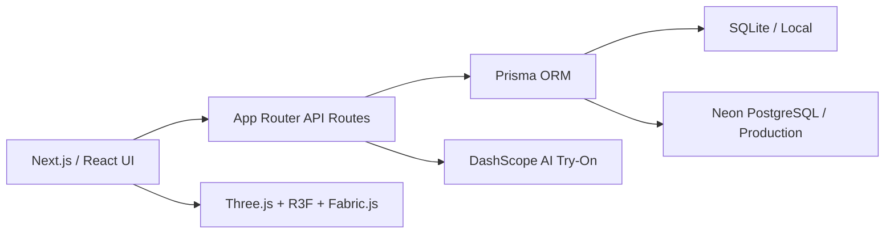

# Aura Wardrobe

> 面向时尚内容创作者的 AI 衣橱搭配与虚拟试穿工具。  
> An AI wardrobe styling and virtual try-on workspace for fashion creators.

[](https://nextjs.org/)
[](https://www.typescriptlang.org/)
[](https://www.prisma.io/)
[](https://aura-wardrobe-zeta.vercel.app)

**[在线体验 Live Demo](https://aura-wardrobe-zeta.vercel.app)** ·
**[开始搭配 Start Styling](https://aura-wardrobe-zeta.vercel.app/tryon)**

Aura Wardrobe 不是一次生成多个随机造型的工具。它围绕创作者自己的照片和衣橱建立完整搭配流程：先决定今天每个部位的颜色和整体风格，再像换装游戏一样选择自己的单品，最后生成、保存并下载上身预览。

Aura Wardrobe is built around the creator's own portrait and wardrobe. Users define the color plan and styling direction first, select real wardrobe pieces through a game-like flow, and then generate a reusable outfit preview.

## Preview / 项目预览

截图资源将在后续文档迭代中补充，以下路径已经预留，不会在 GitHub 上显示破损图片。

| Planned screenshot | 内容 |
| --- | --- |
| `docs/images/homepage-canvas.webp` | 电影感首页、动态花朵背景与液态玻璃鼠标效果 |
| `docs/images/color-style-flow.webp` | 分部位配色、可选内搭与帽子、风格筛选 |
| `docs/images/wardrobe-preview.webp` | 游戏式选衣、AI 生成结果与历史记录 |

<!-- Screenshot: docs/images/homepage-canvas.webp -->
<!-- Screenshot: docs/images/color-style-flow.webp -->
<!-- Screenshot: docs/images/wardrobe-preview.webp -->

## Product Idea / 产品理念

时尚博主通常拥有大量真实衣服，但每天搭配时仍需要反复考虑颜色、风格和单品组合。Aura Wardrobe 将这个过程拆成连续、可修改的判断，而不是直接让模型替用户随机决定：

1. 上传本人照片，建立统一试穿基底。
2. 决定今天是否需要内搭，并按需选择颜色。
3. 分别设置上衣、裤装、鞋子和袜子的颜色。
4. 决定是否需要帽子，并按需选择颜色。
5. 选择 `Street`、`Clean Fit` 或 `Old Money` 等风格方向。
6. 系统根据颜色、风格和来源为衣橱单品排序。
7. 像换装游戏一样选择各部位单品，生成 AI 上身预览。
8. 保存搭配会话，在个人主页查看、下载或删除记录。

The product turns styling into a sequence of editable decisions instead of a one-shot generation. Color planning narrows the wardrobe, style defines the direction, and the creator keeps control over the final outfit.

## Core Features / 核心能力

### Product

- 用户注册、登录、退出与受保护页面跳转
- 本人照片上传与浏览器端图片压缩
- 衣橱单品新增、读取和删除
- 类别、颜色、品牌、尺码、材质与风格标签
- 按部位设置并随时修改颜色
- 内搭与帽子的可选分支
- 基于颜色、风格和用户衣橱来源的推荐排序
- 游戏式外套、内搭、裤装、鞋子与配饰选择
- AI 试衣生成、进度查询和异常提示
- 搭配预览保存、历史查看、图片下载和记录删除
- 独立 Canvas 编辑页，可调整上传素材的构图

### Experience

- 高级时装与电影感视觉语言
- 全站共享动态花朵背景
- Three.js / WebGL 液态玻璃首页交互
- 毛玻璃面板、响应式布局与明确的步骤状态
- 开发环境 AI 服务不可用时提供带标识的本地演示结果

## Engineering Highlights / 工程亮点

### 1. Decision-first styling flow

配色不是一个笼统的“主色”字段，而是针对内搭、上衣、裤装、鞋子、袜子和帽子的分项计划。可选部位拥有独立状态，用户跳过内搭或帽子后，后续选衣阶段也会同步移除对应槽位。

### 2. Wardrobe-aware recommendations

系统会综合单品所属部位、颜色匹配、风格关键词和是否来自用户衣橱进行排序。系统示例素材只用于补充候选，用户自己的衣服拥有优先权。

### 3. Development and production database split

- **Local development:** SQLite + `prisma/schema.prisma`
- **Vercel production:** Neon PostgreSQL + `prisma/schema.postgresql.prisma`

这种配置保留了本地启动速度，同时让线上环境拥有托管数据库和持久化能力。

### 4. Explicit AI fallback

配置 `DASHSCOPE_API_KEY` 后，后端调用 DashScope 图像生成接口。开发环境缺少 API Key 或上游暂时失败时，会生成明确标注为 `Local demo` 的搭配板，确保产品流程可以继续验证；生产环境不会静默使用该回退。

### 5. Canvas and WebGL presentation

首页使用 React Three Fiber、Three.js 和自定义 Canvas 内容实现液态玻璃折射体验；独立预览编辑页使用 Fabric.js 管理图像画布。这些视觉层与业务表单解耦，避免 WebGL 状态影响核心试衣流程。

## Architecture / 技术架构



| Layer | Technology | Responsibility |
| --- | --- | --- |
| Application | Next.js 16, React 19, TypeScript | 路由、页面、客户端状态与 API |
| Styling | Tailwind CSS 4, custom CSS | 奢侈品视觉系统、响应式布局、毛玻璃材质 |
| 3D / Canvas | Three.js, React Three Fiber, Drei, Fabric.js | 首页折射交互与独立画布编辑 |
| Data | Prisma 6, SQLite, Neon PostgreSQL | 用户、衣橱、试衣历史和搭配会话 |
| Authentication | bcrypt, JWT, HTTP-only cookies | 注册、登录与接口鉴权 |
| AI | DashScope | AI 虚拟试衣与任务状态查询 |
| Deployment | Vercel | Next.js 托管、生产构建与环境变量 |

## Project Structure / 项目结构

```text
clothes/
├── app/
│   ├── prisma/
│   │   ├── schema.prisma             # SQLite local schema
│   │   └── schema.postgresql.prisma  # Neon production schema
│   ├── public/                       # Fonts, 3D models and visual assets
│   ├── src/
│   │   ├── app/                      # Pages and App Router API routes
│   │   ├── components/               # Home, try-on, preview and UI components
│   │   └── lib/                      # Prisma, JWT and creator-preview rules
│   ├── .env.example
│   ├── package.json
│   └── vercel.json
├── docs/                             # Product and engineering documents
└── README.md                         # GitHub project overview
```

## Quick Start / 本地运行

### Requirements

- Node.js 20 or newer
- npm

### 1. Install

```bash
git clone https://github.com/zykll18/clothes.git
cd clothes/app
npm install
```

### 2. Configure environment variables

```bash
cp .env.example .env
```

```env
DATABASE_URL="file:./dev.db"
JWT_SECRET="replace-with-a-random-secret"
DASHSCOPE_API_KEY="your-dashscope-api-key"
NEXTAUTH_URL="http://localhost:3000"
```

| Variable | Local | Production | Purpose |
| --- | --- | --- | --- |
| `DATABASE_URL` | SQLite URL from the example | Neon PostgreSQL connection string | Prisma database connection |
| `JWT_SECRET` | Required | Required | Signs authentication tokens |
| `DASHSCOPE_API_KEY` | Optional for labelled demo mode | Required for real AI generation | DashScope API authentication |
| `NEXTAUTH_URL` | `http://localhost:3000` | Optional | Reserved application base URL |
| `UPLOAD_MAX_SIZE` | Provided in example | Optional | Reserved upload limit configuration |
| `UPLOAD_ALLOWED_TYPES` | Provided in example | Optional | Reserved upload MIME configuration |

`NEXTAUTH_URL`, `UPLOAD_MAX_SIZE`, and `UPLOAD_ALLOWED_TYPES` are reserved configuration values that are not currently read by the runtime. Current upload validation is implemented in the relevant client flows rather than through one central policy.

### 3. Initialize the local database

```bash
npm run db:generate
npm run db:push
```

### 4. Start development

```bash
npm run dev
```

Open [http://localhost:3000](http://localhost:3000).

## Available Commands / 常用命令

| Command | Description |
| --- | --- |
| `npm run dev` | Start the Next.js development server |
| `npm run build` | Create the standard production build |
| `npm run build:vercel` | Generate the PostgreSQL Prisma client, push schema and build for Vercel |
| `npm run start` | Start a previously built application |
| `npm test` | Run creator-preview rule tests |
| `npm run lint` | Run ESLint |
| `npm run db:generate` | Generate the local Prisma client |
| `npm run db:push` | Push the local SQLite schema |
| `npm run db:studio` | Open Prisma Studio |
| `npm run db:migrate` | Create and apply a local Prisma migration |

## Deploying to Vercel / 部署

1. Import the GitHub repository into Vercel.
2. Set **Root Directory** to `app`.
3. Connect a Neon PostgreSQL database through Vercel Marketplace.
4. Add the required `DATABASE_URL`, `JWT_SECRET`, and `DASHSCOPE_API_KEY` environment variables.
5. Keep the build command from `app/vercel.json`:

```bash
npm run build:vercel
```

The command generates Prisma Client from `prisma/schema.postgresql.prisma`, synchronizes the production schema, and runs the Next.js webpack build.

## Verification / 质量检查

```bash
cd app
npm test
npm run lint
npm run build
```

The current automated suite covers creator-preview payload validation and optional color-plan rules. Production builds additionally validate TypeScript and App Router compilation.

## Current Limitations / 当前限制

- AI 生成质量、速度和可用性依赖 DashScope 服务。
- 上传图片目前经过浏览器 Canvas 压缩后以 data URL 存储，尚未接入独立对象存储。
- 衣橱接口目前支持新增、读取和删除，尚未提供完整的单品编辑接口。
- 自动化测试主要覆盖搭配会话数据和配色完成规则，端到端浏览器测试仍需补充。
- README 截图位置已经预留，真实产品截图将在后续文档迭代中添加。

## Roadmap / 下一步

- 接入 Vercel Blob 或兼容的对象存储，替换 data URL 持久化
- 补充衣橱单品编辑与批量标签能力
- 增加 Playwright 端到端测试和 GitHub Actions
- 优化移动端 WebGL 降级策略与加载性能
- 补充 README 截图、流程 GIF 和架构演示

## License

This project is currently provided as a portfolio and interview demonstration. No open-source license has been declared yet.
