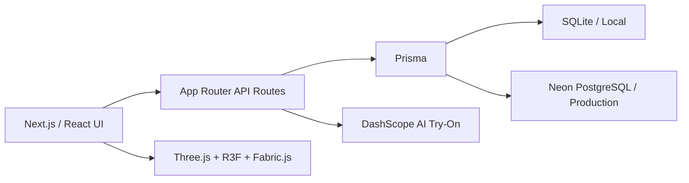

# Aura Wardrobe README Refresh Implementation Plan

> **For agentic workers:** REQUIRED SUB-SKILL: Use superpowers:subagent-driven-development (recommended) or superpowers:executing-plans to implement this plan task-by-task. Steps use checkbox (`- [ ]`) syntax for tracking.

**Goal:** Replace the existing README with a bilingual product and engineering case study that accurately documents Aura Wardrobe, its complete styling workflow, local setup, and Vercel deployment.

**Architecture:** Keep the complete GitHub-facing documentation in the repository-level `README.md`, because GitHub does not automatically render `app/README.md` on the project homepage. Use Chinese as the primary language with concise English summaries, HTML comments for future screenshots, and tables for workflow, technology, environment variables, and project structure. Keep `app/README.md` as a short development entry that links to the canonical root document.

**Tech Stack:** Markdown, Next.js 16, React 19, Tailwind CSS 4, Prisma, SQLite, Neon PostgreSQL, DashScope, Three.js, React Three Fiber, Fabric.js, Vercel

---

### Task 1: Rewrite the README

**Files:**
- Create: `README.md`
- Modify: `app/README.md`
- Reference: `app/package.json`
- Reference: `app/.env.example`
- Reference: `app/vercel.json`
- Reference: `app/prisma/schema.prisma`
- Reference: `app/prisma/schema.postgresql.prisma`

- [ ] **Step 1: Replace the project introduction**

Write a concise bilingual introduction containing:

```markdown
# Aura Wardrobe

> 面向时尚内容创作者的 AI 衣橱搭配与虚拟试穿工具。  
> An AI wardrobe styling and virtual try-on workspace for fashion creators.

[在线体验](https://aura-wardrobe-zeta.vercel.app) · [开始搭配](https://aura-wardrobe-zeta.vercel.app/tryon)
```

Add badges for Next.js, TypeScript, Prisma, and Vercel without claiming test coverage or build status that is not published by CI.

- [ ] **Step 2: Add non-breaking screenshot placeholders**

Reserve three future asset locations without rendering broken images:

```markdown
<!-- Screenshot: docs/images/homepage-canvas.webp -->
<!-- Screenshot: docs/images/color-style-flow.webp -->
<!-- Screenshot: docs/images/wardrobe-preview.webp -->
```

Label each planned screenshot in a small table so a GitHub visitor understands what will be shown later.

- [ ] **Step 3: Document the product problem and workflow**

Explain that creators upload their portrait and wardrobe, decide color and style before selecting clothes, and generate a preview from their own pieces. Document these stages:

1. Portrait setup
2. Optional innerwear decision
3. Per-slot color planning
4. Optional hat decision
5. Style selection
6. Wardrobe filtering and game-like item selection
7. AI generation, saving, history, and download

- [ ] **Step 4: Document implemented capabilities and engineering decisions**

Include only repository-backed features:

- Authentication and protected routes
- Wardrobe CRUD and clothing metadata
- Editable per-slot color plan
- Optional innerwear and hat branches
- Style filtering and ranked wardrobe recommendations
- DashScope try-on with labelled local development fallback
- Saved creator preview sessions, history, deletion, and download
- Canvas preview editor
- Cinematic flower background and homepage WebGL liquid-glass interaction
- Local SQLite and production Neon PostgreSQL split

- [ ] **Step 5: Add architecture, stack, and project structure**

Use a compact architecture diagram:



Describe the responsibility of `src/app`, `src/components`, `src/lib`, `prisma`, and `public`.

- [ ] **Step 6: Add verified local setup and deployment instructions**

Document:

```bash
cd app
npm install
cp .env.example .env
npm run db:generate
npm run db:push
npm run dev
```

Explain:

- Local Prisma schema: `prisma/schema.prisma`
- Production Prisma schema: `prisma/schema.postgresql.prisma`
- Vercel Root Directory: `app`
- Required production variables: `DATABASE_URL`, `JWT_SECRET`, `DASHSCOPE_API_KEY`
- Reserved variables that are not currently consumed by runtime code: `NEXTAUTH_URL`, `UPLOAD_MAX_SIZE`, `UPLOAD_ALLOWED_TYPES`
- Production build command: `npm run build:vercel`

- [ ] **Step 7: Add testing, limitations, and next steps**

List the verified commands:

```bash
npm test
npm run lint
npm run build
npm run build:vercel
```

State current limitations directly:

- AI output quality and latency depend on DashScope.
- Uploaded images are currently represented as application data URLs rather than a dedicated object-storage pipeline.
- Automated tests currently focus on creator-preview payload and color-plan rules.
- Screenshot assets are intentionally reserved for a later documentation pass.

- [ ] **Step 8: Validate the README**

Run:

```bash
rg -n "TBD|TODO|FIXME|localhost:3000/tryon|future work" README.md
git diff --check
npm test
npm run lint
```

Expected:

- No unresolved placeholders except the intentional HTML screenshot comments
- No whitespace errors
- All tests pass
- ESLint exits with code 0

- [ ] **Step 9: Commit the README**

```bash
git add ../README.md README.md docs/superpowers/plans/2026-06-22-readme-refresh.md
git commit -m "docs: rewrite project README"
```
