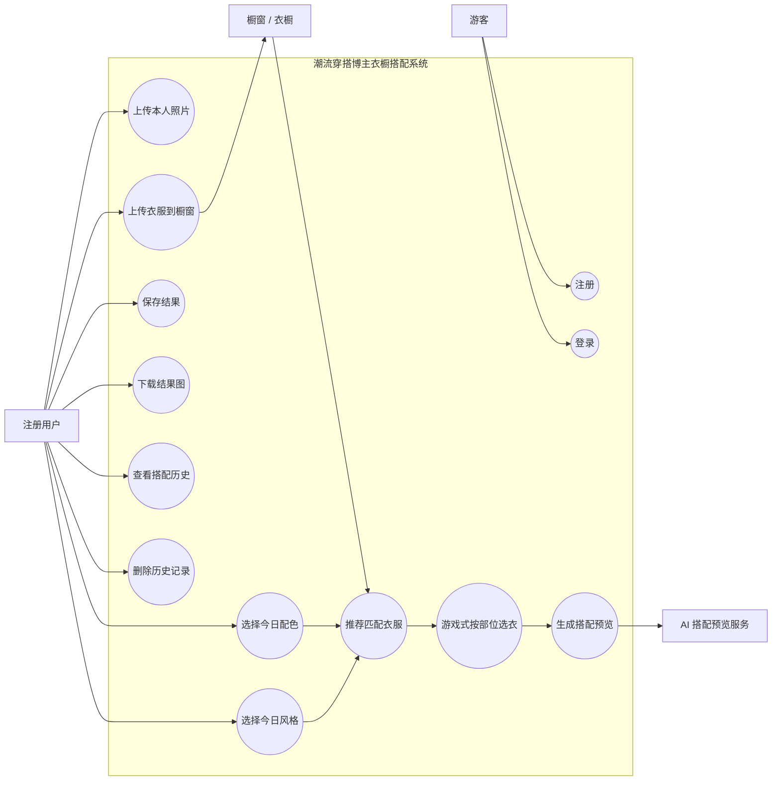

# 潮流穿搭博主衣橱搭配预览工具需求文档

## 1. 文档定位

本文件是当前项目自 `2026-05-27` 起的最新需求基线。

它用于把项目从“同一套 look 的多方向内容预演”修正为“面向潮流穿搭博主的衣橱搭配预览工具”，并为后续设计、前端和后端实现提供统一口径。

如与以下文档冲突，以本文件为准：

- [PRD.md](/Users/zyk/Desktop/clothes/PRD.md:1)
- [requirements-foundation.md](/Users/zyk/Desktop/clothes/docs/product/requirements-foundation.md:1)

## 2. 产品重新定位

### 2.1 一句话定义

这是一个帮助潮流穿搭博主把自己的衣服上传到橱窗里，再按今天的配色和风格快速搭出一套 look，并生成上身预览的 AI 工具。

### 2.2 不再主打什么

当前版本不再主打：

- 同一套 look 的 3 个内容方向比较
- 发布前判断“这条内容该发哪一版”
- 通用消费者购物决策
- 精准尺码推荐
- 电商转化或退货优化
- 面向所有服饰商家的通用 SaaS

### 2.3 当前主打什么

当前版本主打：

- 博主自己的衣橱 / 橱窗管理
- 按配色和风格筛选衣服
- 像换装游戏一样选择外套、内搭、下装、鞋子、配饰
- 生成一套搭配后的上身预览
- 保存搭配结果，方便后续拍摄、发布或复盘

## 3. 目标用户

### Persona A：潮流穿搭博主

**身份**

- 抖音 / 小红书潮流穿搭博主
- 粉丝量通常在 `1k - 10k` 起步阶段
- 有自己的衣服和常用单品，希望提高日常搭配效率
- 风格偏街头、clean fit、老钱、美式复古、通勤、机能等

**动机**

- 每天要发内容，需要更快决定今天穿什么
- 衣服很多，但临时搭配时容易乱
- 想先看“这套搭在自己身上大概成不成立”
- 希望减少反复换衣、拍照、返工的成本

**目标**

- 把自己的衣服上传到橱窗
- 先确定今天的配色
- 再确定今天的风格
- 根据配色和风格，从衣橱里得到可用推荐
- 像游戏换装一样选出一整套
- 生成上身预览，判断是否值得真正拍摄或发布

**约束**

- 不想学习复杂搭配软件
- 更关心整体效果、风格和出片感，不追求第一版精准尺码
- 希望流程轻、快、直观，有明确的下一步

## 4. 核心问题

潮流穿搭博主在日常搭配和发内容前，通常会遇到这些问题：

- 衣服很多，但不知道今天应该怎么搭
- 想先按颜色定调，但很难快速从衣橱里找出匹配单品
- 知道今天想走某种风格，但不知道哪些衣服符合
- 想在真正换衣和拍摄前，先看一眼搭配效果
- 想保存好看的搭配，之后复用或继续优化

当前项目要解决的不是“同一套 look 发哪个方向”，而是：

`根据博主自己的衣橱，按配色和风格搭出一套可预览的 look。`

## 5. 产品目标

### 5.1 MVP 目标

- 帮助博主建立自己的衣橱 / 橱窗
- 让博主按“今日配色 + 今日风格”快速筛出可搭配衣服
- 让博主用游戏式选衣方式完成一整套搭配
- 生成这套搭配在本人照片上的预览图
- 保存和回看搭配结果

### 5.2 成功标准

当前 MVP 成功至少意味着：

- 用户可以完成一次完整闭环：登录、上传本人、上传衣服、选择配色、选择风格、选衣、生成、保存、下载
- 用户能在衣橱中看到自己上传的衣服
- 推荐结果会优先展示匹配当前配色和风格的衣服
- 用户能按部位完成一套搭配
- 生成失败或保存失败时，用户能理解问题并继续流程

## 6. MVP 范围

### 6.1 当前包含

- 邮箱注册与登录
- 上传本人照片
- 上传衣服到橱窗 / 衣橱
- 衣服基础信息：名称、图片、类别、颜色、风格标签
- 选择今日配色
- 选择今日风格
- 根据配色和风格推荐衣橱里的衣服
- 按部位选择衣服：外套、内搭、下装、鞋子、配饰
- 生成一张最终搭配预览
- 保存搭配历史
- 在个人中心查看、下载、删除历史

### 6.2 当前不包含

- 同一套 look 的 3 个方向对比
- 自动写文案
- 自动推荐爆款选题
- 品牌协作空间
- 评论与批注
- 社交分享链路
- 精准尺码和合身判断
- 3D / AR 试衣
- 复杂推荐算法或大规模用户偏好建模

## 7. 核心场景

### Scenario 1：今天出门 / 发内容前搭一套

**用户**

- 潮流穿搭博主

**目标**

- 根据今天想要的颜色和风格，从自己的衣橱里快速搭出一套 look

**触发条件**

- 用户准备拍摄或出门，但还没确定今天穿什么

**主流程**

1. 用户登录系统
2. 用户上传或选择本人照片
3. 用户进入橱窗，上传多件衣服
4. 用户选择今天的主色，例如 `black / grey / navy`
5. 用户选择今天的风格，例如 `街头 / clean fit / 老钱 / 美式复古`
6. 系统根据配色和风格推荐衣橱里的相关衣服
7. 用户像游戏换装一样，按部位选择外套、内搭、下装、鞋子、配饰
8. 用户发起生成
9. 系统返回最终搭配预览图
10. 用户保存或下载结果

**结果**

- 用户得到一套基于自己衣橱的搭配预览

### Scenario 2：衣橱很多，先筛掉不适合今天的衣服

**用户**

- 衣服素材较多的穿搭博主

**目标**

- 不从全部衣服里手动找，而是先按今天的配色和风格缩小范围

**主流程**

1. 用户选择今日配色
2. 用户选择今日风格
3. 系统把更匹配的衣服排到前面
4. 用户只在推荐结果里做选择
5. 用户完成搭配并生成预览

**结果**

- 用户减少翻衣橱和临时试错成本

### Scenario 3：积累自己的可复用搭配

**用户**

- 希望持续沉淀个人风格样本的博主

**目标**

- 保存搭配结果，之后继续复用或复盘

**主流程**

1. 用户完成一套搭配生成
2. 用户保存结果
3. 用户在历史里查看搭配使用了哪些衣服、配色和风格
4. 用户下载结果图或重新发起类似搭配

**结果**

- 用户逐步积累自己的搭配库

## 8. 核心流程

## 9. 功能语义调整

为减少现有代码改造成本，第一版不推翻全部已有结构，但要统一语义：

- 原 `内容预演`：调整为 `搭配预览`
- 原 `素材库`：调整为 `橱窗 / 衣橱`
- 原 `方向标签`：调整为 `风格选择`
- 原 `三方向结果`：移除，改成 `一套最终搭配预览`
- 原 `主素材`：移除，改成按部位选择衣服
- 原 `系统单品`：可作为空衣橱时的补位内容，但不应该抢用户衣橱主位

## 10. 对现有项目的实现约束

当前项目应优先做“流程重定位”，而不是一次性做复杂推荐系统。

### 10.1 优先复用

- 登录 / 注册
- 当前衣服上传能力
- 当前衣橱数据
- 当前人物上传能力
- 当前 AI 生成接口
- 当前历史记录和下载能力
- 当前偏 editorial 的视觉语言

### 10.2 第一批必须改

- 首页文案与定位
- `/tryon` 主流程，从“三方向内容预演”改成“配色 + 风格驱动的衣橱搭配”
- 推荐池逻辑，从“选一个主素材”改成“按部位推荐可选衣服”
- 结果页布局，从“三张方向卡”改成“一张最终搭配预览”
- 历史页语义，从“内容预演历史”改成“搭配预览历史”
- 衣服上传表单补上风格标签输入

### 10.3 暂不进入

- 多张 AI 结果并行生成
- 复杂搭配算法
- 自动文案生成
- 社交发布链路
- 品牌合作空间
- 尺码和版型算法

## 11. 前端实现口径

后续前端应统一按以下流程理解 `/tryon`：

1. `人物入镜`
   用户上传或确认本人照片。

2. `建立橱窗`
   用户上传衣服到衣橱，衣服至少需要类别、颜色、风格标签。

3. `今日配色`
   用户选择今天想走的主色或配色方向。

4. `今日风格`
   用户选择今天想走的风格。

5. `推荐衣服`
   系统按颜色和风格，把匹配衣服排到前面。

6. `游戏式选衣`
   用户按外套、内搭、下装、鞋子、配饰选择一整套。

7. `生成预览`
   系统根据本人照片和用户最终选择的搭配生成一张结果图。

8. `保存历史`
   保存本人照片、配色、风格、选中的衣服组合和结果图。

## 12. 后端与数据要求

前端需要后端至少提供以下数据能力：

- 衣服列表读取：按用户返回全部衣服
- 衣服创建：支持名称、图片、类别、颜色、风格标签
- 衣服删除：删除用户自己的衣服
- 搭配预览保存：保存人物图、配色、风格、选中衣服 ID、结果图
- 搭配预览读取：返回历史记录和相关结果图
- 搭配预览删除：删除用户自己的历史

如果后端已经完成字段变更，前端应直接对齐新字段；如果后端仍使用旧字段，第一版可暂时用 `tags` 承载风格标签，但 UI 语义必须是“风格”。

## 13. Agent 执行口径

若后续由其他 agent 继续实现，应统一按以下口径理解项目：

- 这是一个 `潮流穿搭博主衣橱搭配预览工具`
- 第一版用户是 `潮流穿搭博主`
- 第一版价值是 `从自己的衣橱里快速搭出一套`
- 第一版输入是 `本人照片 + 衣橱衣服 + 今日配色 + 今日风格`
- 第一版交互是 `像游戏换装一样按部位选衣服`
- 第一版输出是 `一张最终搭配预览图`
- 不再把 `3 个内容方向比较` 作为主流程
